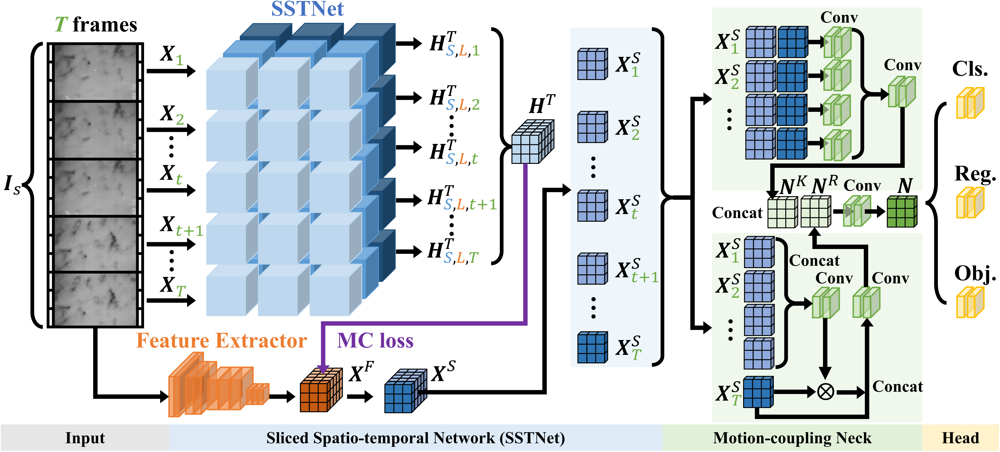

# SSTNet

The Pytorch implementation of the **TGRS 2024** paper [**SSTNet: Sliced spatio-temporal network with cross-slice ConvLSTM for moving infrared dim-small target detection**](https://ieeexplore.ieee.org/abstract/document/10381806)



## Abstract
Infrared dim-small target detection, as an important branch of object detection, has been attracting research attention in recent decades. Its challenges mainly lie in the small target sizes and dim contrast to background images. Recent research schemes on it mainly focus on improving the feature representation of spatio-temporal domains only in single-slice temporal scope. More cross-slice motion, i.e., past and future, is seldom considered to enhance target features. To utilize cross-slice motion context, this paper proposes a sliced spatio-temporal network (SSTNet) with cross-slice enhancement for moving infrared dim-small target detection.  In our scheme, a new cross-slice ConvLSTM node is designed to capture spatio-temporal motion features from both inner-slice and inter-slices. Moreover, to improve infrared small target motion feature learning, we extend conventional loss function by adopting a new motion-coordination loss term. On these, we propose a motion-coupling neck to assist feature extractor in facilitating the capturing and utilization of motion features from multi-frames. To our best knowledge, our work is the first one to explore the cross-slice spatio-temporal motion modeling for infrared dim-small targets. Experiments verify that our SSTNet could refresh most state-of-the-art metrics on two public benchmarks (DAUB and IRDST).


## Datasets

- Datasets are available at [DUAB](https://pan.baidu.com/s/1nNTvjgDaEAQU7tqQjPZGrw?pwd=saew)(code: saew) and [IRDST](https://pan.baidu.com/s/1igjIT30uqfCKjLbmsMfoFw?pwd=rrnr)(code: rrnr).
- Or you can download them directly from the website: [DAUB](https://www.scidb.cn/en/detail?dataSetId=720626420933459968) and [IRDST](https://xzbai.buaa.edu.cn/datasets.html). In addition, you need to reorganize these datasets in a format similar to the **coco_train.txt** and **coco_val.txt** file we provided.

- The COCO format json file needs to be converted into a txt format file. We provide txt format files for DAUB and IRDST.
- Or you can generate a new txt file based on the path of your datasets. We also provide [json](./json) files for DAUB and IRDST.
``` python 
python utils_coco/coco_to_txt.py
```


## Prerequisite

* python==3.10.11
* pytorch==1.12.0
* torchvision==0.13.0
* numpy==1.24.3
* opencv-python==4.7.0.72
* pillow==9.5.0
* scipy==1.10.1
* Tested on Ubuntu 20.04, with CUDA 11.3, and 1x NVIDIA 3090.


## Usage

### Train
```python
CUDA_VISIBLE_DEVICES=0 python train_{dataset}.py
```

### Test
- Usually model_best.pth is not necessarily the best model. The best model may have a lower val_loss or a higher AP50 during verification.
```python
python vid_map_coco.py
```

### Visulization
```python
python vid_predict.py
```

## Results

- PR curve on DAUB and IRDST datasets.
- We provide the results on [DAUB](./readme/DAUB_results) and [IRDST](./readme/IRDST_results), and you can plot them using Python.


## Contact
If any questions, kindly contact with Shengjia Chen via e-mail: csj_uestc@126.com.

## References
1. X. Shi, Z. Chen, H. Wang, D.-Y. Yeung, W.-K. Wong, and W.-c. Woo, “Convolutional lstm network: A machine learning approach for precipitation nowcasting,” Advances in Neural Information Processing Systems, vol. 28, 2015.
2. Z. Ge, S. Liu, F. Wang, Z. Li, and J. Sun, “Yolox: Exceeding yolo series in 2021,” arXiv preprint arXiv:2107.08430, 2021.

## Citation

If you find this repo useful, please cite our paper. 

```
@ARTICLE{sstnet2024,
  author={Chen, Shengjia and Ji, Luping and Zhu, Jiewen and Ye, Mao and Yao, Xiaoyong},
  journal={IEEE Transactions on Geoscience and Remote Sensing}, 
  title={SSTNet: Sliced spatio-temporal network with cross-slice ConvLSTM for moving infrared dim-small target detection}, 
  year={2024},
  volume={},
  number={},
  pages={1-1},
  doi={10.1109/TGRS.2024.3350024}}
  
```


